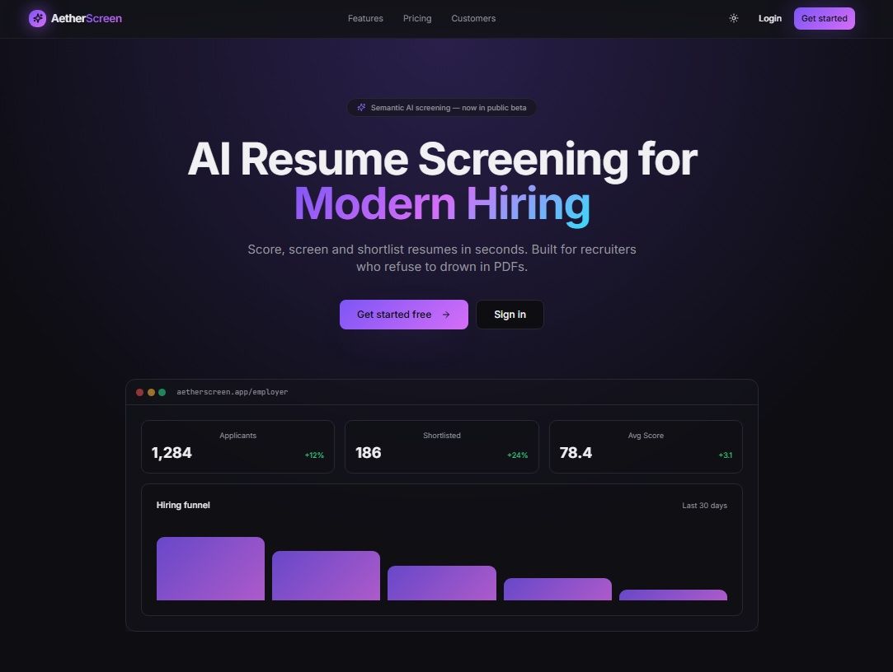

# AI Resume Screening Platform

[](https://www.python.org/)
[](https://www.djangoproject.com/)
[](https://www.django-rest-framework.org/)
[](https://docs.celeryq.dev/)
[](https://www.docker.com/)
[](LICENSE)

Modern, production-minded web platform for semantic resume screening. Backend is Django + DRF with an AI scoring pipeline; frontend is Vite + React.

---

<!-- TOC -->
## Table of Contents
- [Demo](#demo)
- [Features](#features)
- [Quick Start](#quick-start)
	- [Backend (dev)](#backend-dev)
	- [Frontend (dev)](#frontend-dev)
	- [Docker (full-stack)](#docker-full-stack)
- [Environment](#environment)
- [Testing](#testing)
- [Project Structure](#project-structure)
- [Contributing](#contributing)
- [License](#license)
- [Contact](#contact)
<!-- /TOC -->

---

## Demo

Screenshot (placeholder):



> To add a real screenshot, place an image at `docs/screenshot.png` and commit it.

---

## Features

- AI semantic matching using `sentence-transformers` embeddings
- Background scoring pipeline with Celery + Redis
- Resume upload (PDF/DOCX) and text extraction
- JWT auth, role-based access (candidate / employer)
- Analytics and CSV export for applicants

---

## Quick Start

These quick instructions get a developer environment running on your machine.

### Backend (dev)

- Path: [Backend/](Backend/) — main entry: [Backend/manage.py](Backend/manage.py)

```powershell
cd Backend
python -m venv .venv
# PowerShell
.venv\Scripts\Activate.ps1
# or CMD
.venv\Scripts\activate
pip install -r requirements.txt
```

Create `.env` (see [Environment](#environment)), run migrations and a dev server:

```powershell
python manage.py migrate
python manage.py createsuperuser
python manage.py runserver
```

Start a Celery worker in a separate terminal:

```powershell
cd Backend
celery -A config worker -l info --pool=solo
```

Open API docs at `http://127.0.0.1:8000/api/docs/`.

---

### Frontend (dev)

- Path: [Frontend/](Frontend/) — see [Frontend/package.json](Frontend/package.json)

```bash
cd Frontend
npm install
npm run dev
# or with bun:
bun install
bun dev
```

Vite will print the local dev URL (commonly `http://localhost:5173`). If the app needs to call the backend, update the API base URL or add a proxy in `vite.config.ts`.

---

### Docker (full-stack)

The Docker compose file in `Backend/docker-compose.yml` brings up web, postgres, redis, celery and nginx.

```bash
cd Backend
docker-compose up --build
```

The site will be available at `http://localhost` once started.

---

## Environment

Create `Backend/.env` (example):

```env
DJANGO_SECRET_KEY=replace-me
DEBUG=True
ALLOWED_HOSTS=localhost,127.0.0.1
DATABASE_URL=sqlite:///db.sqlite3
CELERY_BROKER_URL=redis://redis:6379/0
CELERY_RESULT_BACKEND=redis://redis:6379/0
```

Store secrets securely in production; the above is for local development.

---

## Testing

- Backend: run `python manage.py test` from `Backend/`.
- Frontend: run `npm run test` (Vitest) from `Frontend/`.

---

## Project Structure

- `Backend/` — Django project with apps for users, jobs, candidates, screening, analytics and Celery configuration.
- `Frontend/` — Vite + React UI.
- `Backend/docker/` — Docker and Nginx assets.

---

## Contributing

Contributions welcome! Please open issues or PRs.

Recommended workflow:

1. Fork the repo
2. Create a feature branch
3. Add tests for backend or vitest for frontend
4. Open a pull request

---

## License

MIT — see [LICENSE](LICENSE).

---

## Contact

Maintainer: Maroof

---

Would you like me to:
- add `Backend/README.md` and `Frontend/README.md` with folder-specific commands?
- add a `docs/screenshot.png` placeholder image and `.env.example` file?


